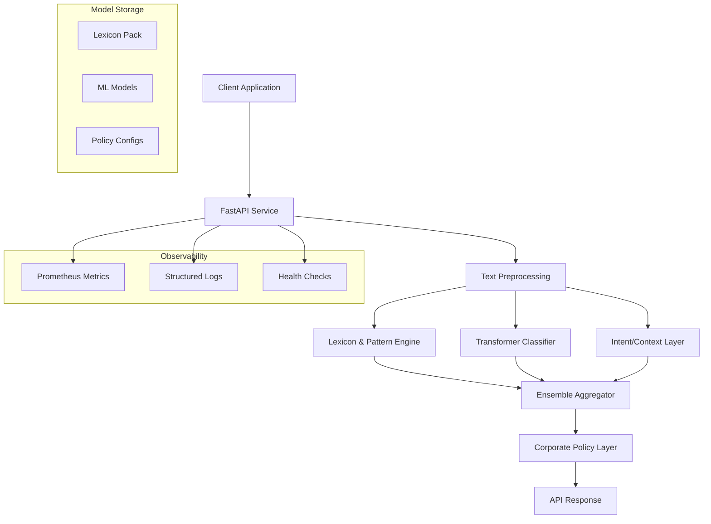

# Harmony Guard Design Document

## Overview

Harmony Guard is a real-time content moderation system built on an ensemble architecture that combines rule-based lexicon matching, transformer-based machine learning, and contextual analysis to achieve high-precision content classification across Indian languages and code-mixed content.

The system processes text through multiple specialized components that work together to detect inappropriate content while handling various obfuscation techniques. The ensemble approach ensures robust coverage and high precision by leveraging the strengths of different detection methods.

## Architecture

### High-Level Architecture



### Component Architecture

The system follows a modular design with clear separation of concerns:

1. **API Layer**: FastAPI-based REST service handling HTTP requests and responses
2. **Preprocessing Pipeline**: Text normalization, language detection, and obfuscation handling
3. **Ensemble Components**: Three parallel analysis engines (LPE, Classifier, Intent)
4. **Aggregation Layer**: Combines and calibrates outputs from ensemble components
5. **Policy Engine**: Applies organization-specific rules and thresholds
6. **Observability Stack**: Monitoring, logging, and health checking

## Components and Interfaces

### 1. Text Preprocessing Pipeline

**Purpose**: Normalize and prepare text for analysis across all ensemble components.

**Key Functions**:
- Language identification using fastText-style model with character n-gram fallback
- Unicode normalization (NFKC) and zero-width character stripping
- Homoglyph normalization and diacritic folding
- Transliteration between Romanized and native scripts
- Leet speak and phonetic obfuscation handling
- Emoji-aware and script-aware tokenization
- Optional PII masking for privacy compliance

**Interface**:
```python
class TextPreprocessor:
    def process(self, text: str) -> ProcessedText:
        """
        Returns ProcessedText containing:
        - normalized_text: cleaned and normalized version
        - detected_languages: list of language codes with confidence
        - tokens: tokenized representation
        - transliterations: alternative script versions
        - obfuscation_map: mapping of normalized terms to originals
        """
```

### 2. Lexicon & Pattern Engine (LPE)

**Purpose**: Rule-based detection using curated lexicons and regex patterns.

**Key Features**:
- Multilingual lexicons for major Indic languages and English
- Weighted entries with category and severity mappings
- Morphological variant handling
- Regex patterns for elongated and obfuscated terms
- Emoji and kaomoji sentiment mapping
- Homograph and leet speak lookup tables

**Interface**:
```python
class LexiconPatternEngine:
    def analyze(self, processed_text: ProcessedText) -> LPEResult:
        """
        Returns LPEResult containing:
        - matched_spans: list of problematic text spans
        - categories: detected abuse categories
        - confidence_scores: rule-based confidence per category
        - rule_traces: which specific rules triggered
        """
```

### 3. Transformer Classifier

**Purpose**: ML-based classification using fine-tuned multilingual transformer.

**Architecture**:
- Base model: XLM-R or equivalent multilingual transformer
- Multi-head architecture with separate heads for:
  - Multi-label abuse category classification
  - Corporate appropriateness decision
  - Severity level prediction
- Fine-tuned on parallel/augmented Indic corpora with code-mix support

**Interface**:
```python
class TransformerClassifier:
    def predict(self, processed_text: ProcessedText) -> ClassifierResult:
        """
        Returns ClassifierResult containing:
        - category_probabilities: softmax scores per abuse category
        - corporate_decision_prob: allow/review/block probabilities
        - severity_scores: predicted severity levels
        - attention_spans: token-level attention for explainability
        """
```

### 4. Intent/Context Layer

**Purpose**: Contextual analysis to handle edge cases and reduce false positives.

**Key Capabilities**:
- Negation detection and handling
- Quotation and third-party reference identification
- Safe-use context recognition (HR reporting, educational content)
- Context-aware confidence adjustment

**Interface**:
```python
class IntentContextLayer:
    def analyze_context(self, processed_text: ProcessedText, 
                       lpe_result: LPEResult, 
                       classifier_result: ClassifierResult) -> ContextResult:
        """
        Returns ContextResult containing:
        - context_modifiers: adjustment factors for categories
        - safe_context_detected: boolean flags for safe contexts
        - recommended_action: context-informed decision
        """
```

### 5. Ensemble Aggregator

**Purpose**: Combine and calibrate outputs from all ensemble components.

**Key Functions**:
- Probability calibration using temperature scaling
- Weighted ensemble combination with learned weights
- Confidence score computation
- Span consolidation and ranking
- Final decision logic with policy rule enforcement

**Interface**:
```python
class EnsembleAggregator:
    def aggregate(self, lpe_result: LPEResult, 
                  classifier_result: ClassifierResult,
                  context_result: ContextResult) -> AggregatedResult:
        """
        Returns AggregatedResult containing:
        - final_decision: allow/review/block
        - confidence_score: overall confidence
        - category_scores: calibrated category probabilities
        - severity_level: final severity assessment
        - explanation_traces: decision reasoning
        """
```

### 6. Corporate Policy Layer

**Purpose**: Apply organization-specific rules and thresholds.

**Configuration Structure**:
```yaml
policy_profile:
  name: "default_corporate"
  block_thresholds:
    threat_violence: { medium: 0.7, high: 0.5, critical: 0.3 }
    hate_targeted: { medium: 0.8, high: 0.6, critical: 0.4 }
  safe_contexts:
    - "hr_reporting"
    - "legal_documentation"
  department_overrides:
    hr: { allow_sensitive_discussions: true }
  tenant_lexicon_overlay: "tenant_specific.yaml"
```

## Data Models

### Core Data Structures

```python
@dataclass
class AnalysisRequest:
    text: str
    tenant_id: Optional[str] = None
    include_details: bool = False
    language_hints: Optional[List[str]] = None

@dataclass
class AnalysisResponse:
    corporate_allowed: Literal["allow", "review", "block"]
    confidence: float
    severity: Literal["low", "medium", "high", "critical"]
    categories: List[str]
    languages: List[Dict[str, Union[str, float]]]
    spans: Optional[List[ProblemSpan]] = None
    explanations: Optional[List[str]] = None
    normalized_preview: Optional[str] = None
    policy_trace: Optional[List[str]] = None

@dataclass
class ProblemSpan:
    text: str
    start: int
    end: int
    category: str
    confidence: float
    rule_source: str

@dataclass
class FeedbackRequest:
    request_id: str
    final_label: str
    actual_categories: List[str]
    comment: Optional[str] = None
    language_hints: Optional[List[str]] = None
    corrected_spans: Optional[List[ProblemSpan]] = None
```

### Model Artifacts Structure

```
harmony-guard/
├── lexicon-pack/
│   ├── languages/
│   │   ├── hi.yaml          # Hindi lexicon
│   │   ├── en.yaml          # English lexicon
│   │   ├── hi-latn.yaml     # Hinglish lexicon
│   │   └── ...
│   ├── emoji.yaml           # Emoji sentiment mapping
│   ├── leet.yaml           # Leet speak substitutions
│   └── homoglyphs.yaml     # Character substitutions
├── models/
│   ├── classifier.bin       # Transformer weights
│   ├── tokenizer/          # Tokenizer files
│   └── lid_model.bin       # Language identification
├── configs/
│   ├── ensemble.yaml       # Ensemble weights and thresholds
│   ├── policy_default.yaml # Default corporate policy
│   └── preprocessing.yaml  # Normalization rules
```

## Error Handling

### Error Categories and Responses

1. **Input Validation Errors** (400 Bad Request)
   - Empty or oversized text input
   - Invalid tenant_id format
   - Malformed request parameters

2. **Processing Errors** (500 Internal Server Error)
   - Model loading failures
   - Preprocessing pipeline errors
   - Ensemble component failures

3. **Timeout Errors** (504 Gateway Timeout)
   - Processing exceeds 200ms timeout
   - Model inference timeout

4. **Rate Limiting** (429 Too Many Requests)
   - Exceeds configured RPS limits per tenant

### Graceful Degradation Strategy

- **LPE Failure**: Fall back to classifier-only mode with reduced confidence
- **Classifier Failure**: Use LPE + Intent layer with conservative thresholds
- **Intent Layer Failure**: Proceed with LPE + Classifier, disable context adjustments
- **Policy Layer Failure**: Apply default hard-coded safety rules

### Circuit Breaker Implementation

```python
class ComponentCircuitBreaker:
    def __init__(self, failure_threshold: int = 5, 
                 recovery_timeout: int = 30):
        self.failure_count = 0
        self.failure_threshold = failure_threshold
        self.recovery_timeout = recovery_timeout
        self.last_failure_time = None
        self.state = "CLOSED"  # CLOSED, OPEN, HALF_OPEN
```

## Testing Strategy

### Unit Testing

**Scope**: Individual component functionality
- Text preprocessing functions (normalization, transliteration, tokenization)
- Lexicon matching algorithms
- Model inference wrapper functions
- Policy rule evaluation logic
- API request/response serialization

**Tools**: pytest, unittest.mock for external dependencies

### Integration Testing

**Scope**: Component interaction and data flow
- End-to-end pipeline from raw text to final decision
- Ensemble aggregation with different component outputs
- Policy application with various tenant configurations
- Feedback loop integration

### Golden Dataset Testing

**Language-Specific Test Sets**:
- Hindi: 1000 samples covering abuse categories and clean content
- English: 1000 samples with corporate communication context
- Hinglish/Code-mix: 500 samples with transliteration variants
- Adversarial: 300 samples with obfuscation techniques

**Evaluation Metrics**:
- Precision/Recall per category and language
- False Positive Rate on clean corporate communications
- Latency percentiles (P50, P95, P99)
- Consistency across script variants

### Load Testing

**Performance Targets**:
- 200 RPS sustained load per pod
- P95 latency ≤ 80ms under load
- Memory usage ≤ 4GB per pod
- CPU utilization ≤ 80% at target RPS

**Test Scenarios**:
- Gradual ramp-up to target RPS
- Spike testing with 2x target load
- Long text processing (up to max sequence length)
- Mixed language distribution matching production

### Security Testing

**Areas of Focus**:
- Input sanitization and injection prevention
- Log redaction verification
- Authentication and authorization
- Rate limiting effectiveness
- PII masking validation

## Deployment Architecture

### Container Strategy

**Base Image**: Python 3.11-slim with security updates
**Multi-stage Build**:
1. Build stage: Install dependencies, compile models
2. Runtime stage: Copy artifacts, minimal runtime dependencies

**Resource Requirements**:
- CPU: 1000m requests, 2000m limits
- Memory: 1Gi requests, 4Gi limits
- Storage: 2Gi for model cache (optional PVC)

### Kubernetes Configuration

**High Availability Setup**:
- Minimum 2 replicas with HPA scaling 2-10 pods
- Pod anti-affinity across nodes
- PodDisruptionBudget allowing max 1 unavailable
- Rolling update strategy with 25% max surge

**Configuration Management**:
- ConfigMap for policy files and thresholds
- Secret for tenant-specific keys and credentials
- Environment variables for feature flags

**Service Mesh Integration**:
- Istio sidecar for traffic management
- mTLS for inter-service communication
- Circuit breaker and retry policies

### Monitoring and Observability

**Metrics Collection**:
```python
# Key metrics to expose
REQUEST_LATENCY = Histogram('harmony_guard_request_duration_seconds')
REQUEST_COUNT = Counter('harmony_guard_requests_total', ['method', 'endpoint', 'status'])
DECISION_COUNT = Counter('harmony_guard_decisions_total', ['decision', 'language'])
CONFIDENCE_HISTOGRAM = Histogram('harmony_guard_confidence_scores', ['category'])
COMPONENT_ERRORS = Counter('harmony_guard_component_errors_total', ['component'])
```

**Alerting Rules**:
- Latency P95 > 100ms for 5 minutes
- Error rate > 1% for 2 minutes
- Precision drop > 2% over 7-day window
- Memory usage > 90% for 10 minutes

This design provides a robust, scalable foundation for the Harmony Guard content moderation system while maintaining the flexibility to adapt to different organizational needs and evolving content patterns.